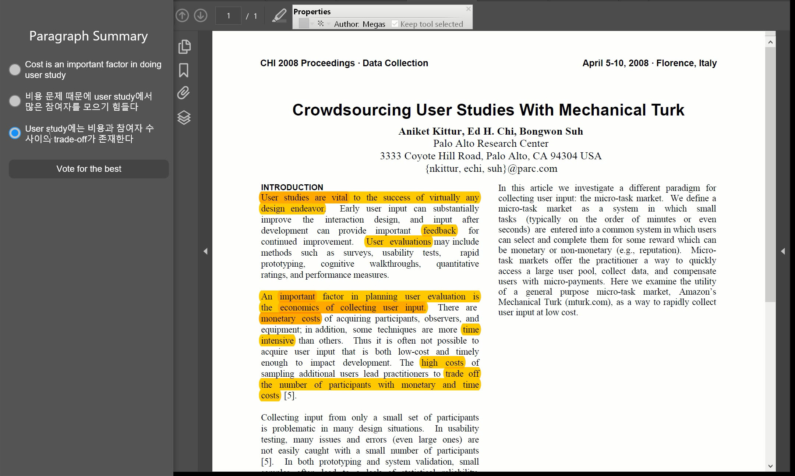

## Milestone 5: Mid-Fi Prototype
- 20164320 Junsoo Park
- 20164350 Youngbo Shim
- 20164352 Sang-Gyun An

### Problem Statement
- Researchers face difficulties in reading scientific papers of unfamiliar fields with a good level of understanding.

### Tasks
- Highlight important bits of text with different colors while reading a paper (not implemented yet)
- Formulate one-sentence summary for each paragraph
- (Please check the attached video to see overall workflow including highlighting)

### Instructions   
- Since our system is not available online yet, and also it needs complex set up process to run in local, we provide you some GUI concept video of our program.
- The video was taken during the low-fi user study step, which is actually controlled by a reader who is new to this system.
- Below is the instruction we ordered to the user. Some tasks such as pros/cons are removed from our design, so you don't need to pay attention to this.
-If you want to check actual web page designs we used, you might want to look in HTML folder in our submission.

##### [Sign in]

- Click ‘Sign in’ button

##### [Group selection view] 

- Click ‘Group 1’ among joined reading groups

##### [Paper selection view] 

- Click ‘Read’ button of the first paper among registered papers within the group

##### [Paper reading view] 

- While reading a paper, use multi-color highlight tool (not implemented yet)
- After reading each paragraph, write and submit your summary

##### [Group result view] 

- After submitting each summary, highlights of the group and others’ summaries are visible
- Vote on the best summary sentence

