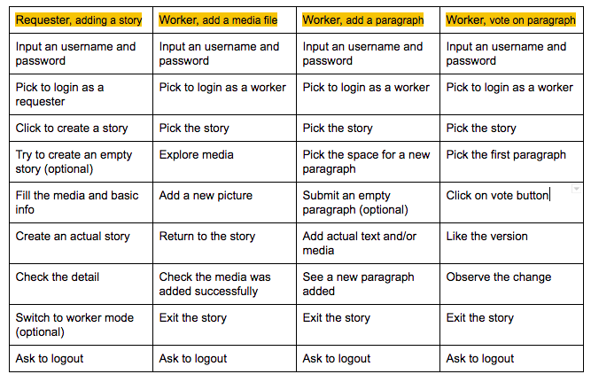
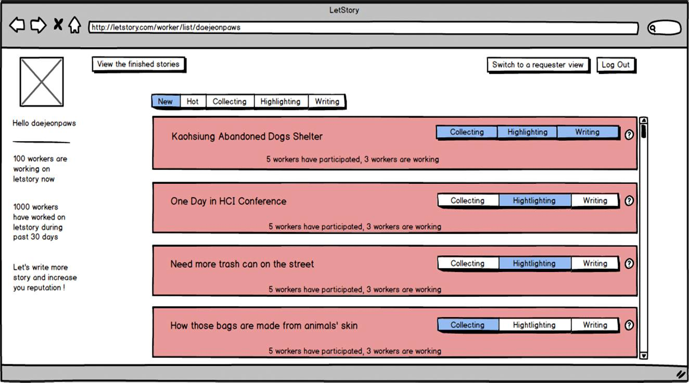
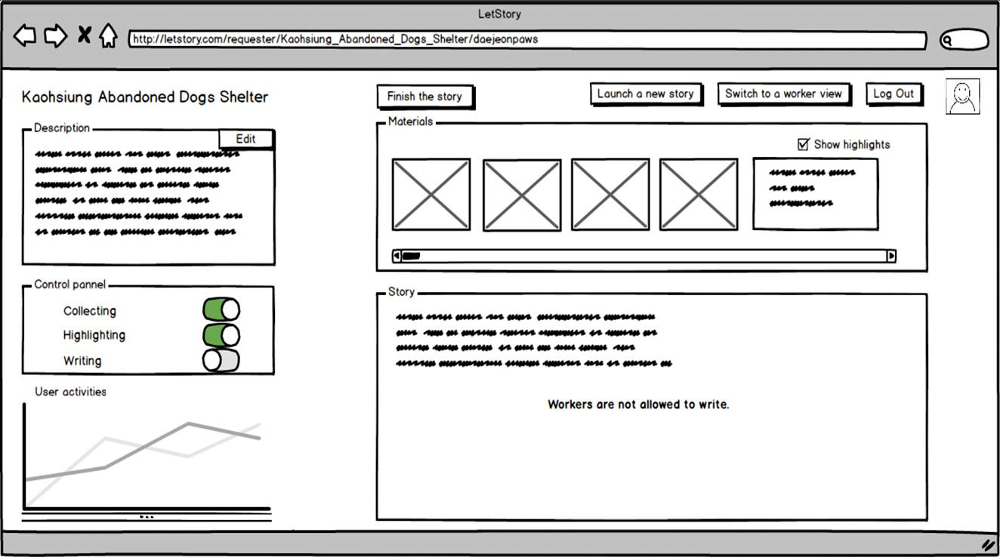
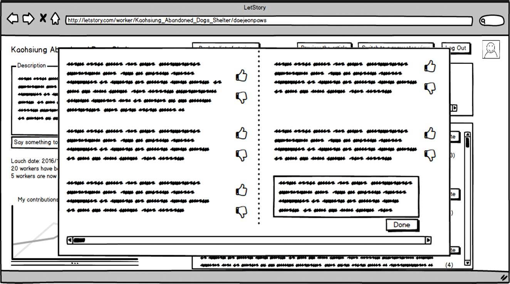
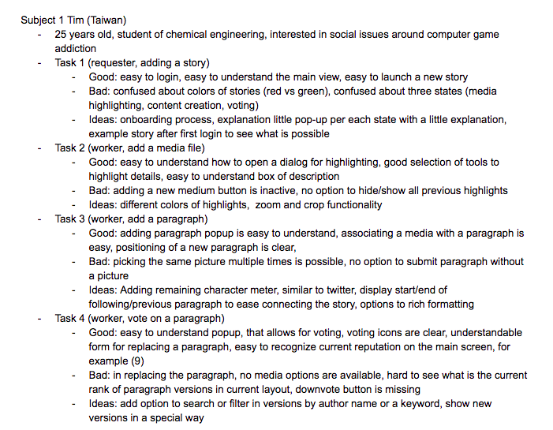
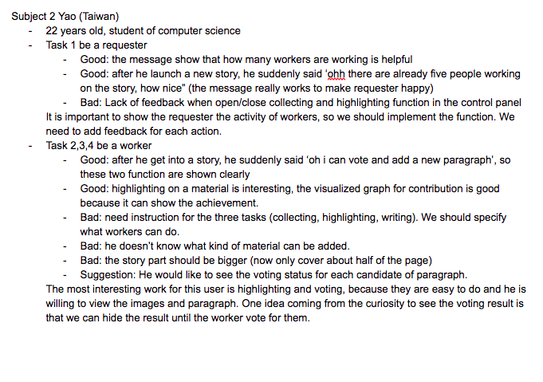
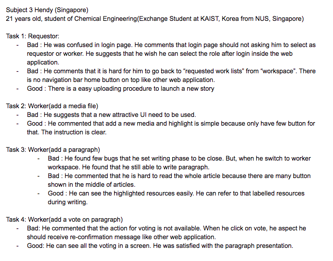

# CrowdStory

Goh Wei Xiang | Liu Ching | Miroslav Masat | Oscar Johanson

### Problem Statement: Re-state the problem you're tackling in your project. Based on what you've learned so far, you can revise your problem statement.

The problem we are trying to solve is a collaborative content creation using the crowd. People may want to create some stories. A blogger need story to attract reader,a  company can use stories to express their culture or history to public, a movie director may want to gain a cool script which is close to people’s life. However, making a story is a hard work for now, relying on experts, usually work alone and take a long time. Every crowd have their own experience that can contribute to a story, or there might be talented crowd who are talented storytellers but it is hard for them to write a long story by themself. SCHEHERAZADE is a crowdsourcing platform that reach to crowd to create a story graph plots. However, they tend to automatically generate the story by using the rough graph plots, which can limit the story structure and also lose the beauty of literature. So our idea is to provide a system that can both assist the crowd to create a structured story and also the final story written in their own language. 

### Tasks: List core tasks (one to three, at least two recommended) you've decided to support in your application. Again, you can make improvements from the initial report.

  

### Prototype on the Invision:

[https://invis.io/2A983CZHR#/204044059_V2_Login1](https://l.facebook.com/l.php?u=https%3A%2F%2Finvis.io%2F2A983CZHR%23%2F204044059_V2_Login1&h=CAQGO6M6D)

### Prototyping tool: Which tool did you choose? Why? What worked well with the tool? What didn't?

Invision is used as a platform to create LetStory Low Fi prototype. Invision provide many features such as sync artwork between Photoshop and Invision. The application called Invision Sync. Direct uploading has become our team favourite feature. We can save the prototype photoshop file in Invision Sync source file. It will directly upload the file in Invision workspace. All the layers in a single photoshop file can be export into many pictures by a single click. It help our team save plenty of time and energy in exporting process. We also used another tool called Balsamiq for designing screens. Whis tool allowed us to use simple drag’n’drop interface for simple elements like buttons, windows, pictures, sliders and forms. This tool is also collaborative, and so, we could work on designs all at the same time, in realtime.

### Design choices: What did you intentionally choose NOT to implement (e.g., fake or hard-coded data, manual algorithm, etc.), and why? 

We did only implement “happy path”, no additional functions like, advanced authentication, error states or notifications were designed. We did try to offload work of content creation from users as well. So in our prototype, forms are automatically fulfilled with one click as a part of happy way. We also hardcoded one user,that can switch between both requester and worker at any time. Lastly, story created is also hard coded, to match our video from stage one of an abandoned dog.  

### Representative screenshots: Include a few most important screenshots that showcase the uniqueness of your application.

  

  

 

### User feedback

 

 

 