Hi-Fi Prototype
=======================

CS492 Crowdsourcing - Final Project: **Milestone 06 (Hi-fi Prototype)** (2016-12-06)

- 20165192 Sunggeun Ahn (topmaze@kaist.ac.kr)
- 20165161 Young-Min Baek (ymbaek@se.kaist.ac.kr)
- 20163703 Sungjae Hong (yain@kaist.ac.kr)

----

## PROJECT SUMMARY

### A. PROBLEM STATEMENT

1. ***"We need to study any time and anywhere."***
	- How can we enable learners to study easily in their daily lives?
2. ***"We need to be motivated to learn."***
	- How can we provide proper stimulation for learning?
3. ***"We need newer and more diverse problems."***
	- Where can we get a number of various problems?

### B. SOLUTION: 1-Day-N-Questions (1DNQ, ODNQ) & DESCRIPTION

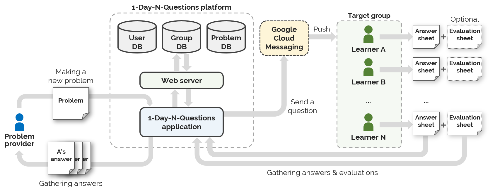

The application which you will use through the prototype is called ***1-Day-N-Questions (1DNQ)***, which is the crowdsourcing platform for the English learners, especially who want to be *stimulated to study*. My team thought about the way to let English learners to get inspired in English study, with the use of smart devices, which most of people daily hold on. For the inspiration task, we *got an idea from offline **English study groups***. Thus, 1DNQ let learners to be clusted into a study group, and to let group members to share learning experiences to other members by making quizzes through the application. Then the application stores and sends the questions to other members, letting them to solve and evaluate the questions. In addition, all these data is stored and analyzed to help the learners to check their own English skills.

- Why do we use crowdsourcing for the study group?
	- Crowds can effectively stimulate learners to study in a person-to-person way.
	- Our ODNQ platform will serve *real name-based* card creation and care distribution.
- Our prototype consists of two subsystems: **(1) ODNQ Android app, (2) ODNQ DB server**
	- *ODNQ Android app* performs (a) card creation, (b) card solving, (c) group management, (d) study review, (e) card management, (f) personal information management, (g) checking my achievements/records, (h) dashboard management, (i) card evaluation, (j) analysis of my achievement
	- *ODNQ DB server* performs (a) user DB management, (b) card DB management, (c) group DB management, (d) card-group relation DB management, (e) push message request, (f) card-distribution algorithm, (g) global settings

----

## INSTRUCTION

### A. INTERFACES OF One-Day-N-Questions (focusing on Android app)

***Main Dashboards***

- My Achievements
- Study Note

***Card management***

- Card creation
- Starring card
- Card evaluation

***Group management***

- Checking my group information
- Leave my existing group
- Make my new group
- Find and join a new group

***Study Reviewing***

- Reviewing starred card
- Solving more word-cards
- Solving system-recommended word-cards

### B. INSTRUCTION-A for TASK 1

***Make a new word-card & Add it to my word note & Share the card with crowds***

- **Instruction**
	- First task is to make a word note with an application. Broadly, the way to make a word note in the application resembles to the way to make a quiz to other people. 
	- At first, you should choose a type of an English vocabulary (in the prototype, it is fixed to "WORD").
	- Second, type a question on the application (in the prototype, it is fixed to "IMMIGRATION").
	- Third, type possible answers on the blank (in the prototype, sample answers are given by a prototype).
	- Next, type possible tags which can characterize the word or the phrase in the question (in the prototype, sample tags are already given).
	- Then, type hints if you want (in the prototype, same hints are already given).
	- You need to also set the time limit of the question.
	- At last, type "OK" button to finish the task.
	- Although most of tasks are done automatically, please imagine that you are doing the task manually.
	- Please do given instructions while you read any English textbook.
	- You can give any kind of feedbacks from very small details such as a name of a button in the application, to a very broad concept.
	- Do this task in 15 minutes. 
- **Image-based prototype**
	- [Marvel prototype link for Task 1](https://marvelapp.com/159c7g9)

### C. INSTRUCTION-B for TASK 2

***Solve a question-card & Check your achievements and study history***

- **Instruction**
	- Second task is to solve a given question of the application, and evaluate it. A question is given to the users by a push alarm (In the prototype, no buzz or sound will be given to an alarm. There will be only a tab announcement with small icon on the upper sidebar).
	- You should do this task while doing other works. When you get an alarm, you check the alarm and clicking the alarm will let you get into the application automatically.
	- When you get into the quiz, you can type a possible answer of the quiz. You have to solve the question in limited time suggested, then click check button to see an answer (In the prototype, answer will be automatically given).
	- After see the answer, you should check whether you are right or wrong, and click right or wrong button according to your answer status (In the prototype, as wrong answer was given, you should check "wrong" button).
	- After solving a question and checking rightness, you can
	 + Push "QUIT" button to end the application, or
	 + Push "Goto 1DNQ App" button to check study status of yourself. In this menu you can check:
		 -	Your study records, including a list of English vocabulary you learned through the application and your English skill status on each type of vocabulary, by using MyStudy menu
		 -	Control study groups you are now in, by using Study group menu, or
		 -	You can quit the application using the sign out button
	- In prototype, you can get a push alarm after quit the application and be in background screen. Thus, after using the application, please push QUIT or sign out button to end the application.
- **Image-based prototype**
	- [Marvel prototype link for Task 2](https://marvelapp.com/125i8fc)

----

## TECHNICAL DESCRIPTION

### A. SYSTEM ARCHITECTURE (+ TECHNICAL STACK)

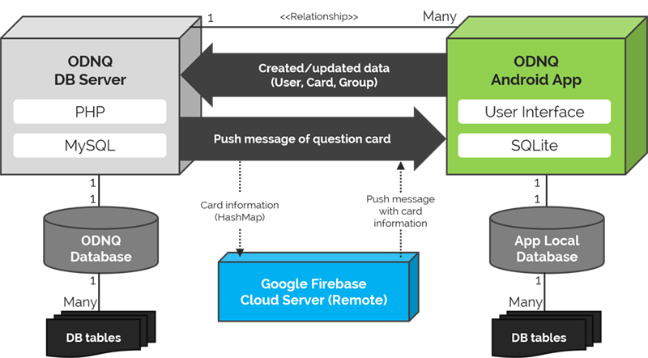

### B. UTILIZED LIBRARY

1. *Firebase cloud server*
	- Official webpage: [Firebase by Google](https://firebase.google.com/?hl=ko)
	- Officail cloud service represented with Google
	- Firebase Cloud Messaging (FCM): used for push notification 
2. *GraphView library*
	- Official webpage: [Android-GraphView](http://www.android-graphview.org/)
	- Graph widget library for android: used for achievement graph
	- Interactive feature with touch listener

### C. DATABASE DESIGN

#### (1) Server Database

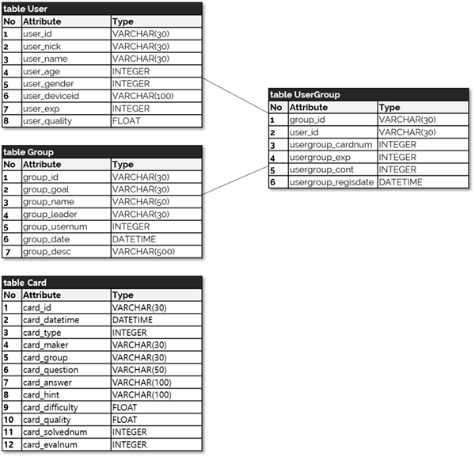

#### (2) Local Database

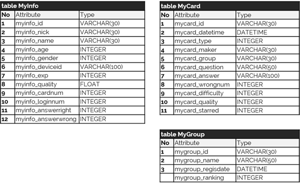

----

## PROTOTYPE

### IMPLEMENTATION PROGRESS

- **ODNQ Android app implementation (Manager: Young-Min Baek)**
	- [IMPLEMENTED] Register a new user
	- [IMPLEMENTED] Store the user information into local DB
	- [IMPLEMENTED] Make a new card
	- [IMPLEMENTED] Store the created new card into local DB & server DB (Server PHP request)
	- [NOT SUPPORTED] Make a new group
	- [NOT SUPPORTED] Join & leave one of my group
	- [IMPLEMENTED] Receive a push message from server
	- [IMPLEMENTED] Parse word-card information from the push message
	- [NOT YET] Show user's achievement dashboard
	- [NOT YET] Show user's own registered group list & group information
- **ODNQ server implementation (Manager: Sungjae Hong)**
	- [IMPLEMENTED] Store the user information 
	- [IN PROGRESS] Read the user information using several keys 
	- [IMPLEMENTED] Store the group information
	- [IN PROGRESS] Read the group information using several keys 
	- [IMPLEMENTED] Store the card information
	- [IN PROGRESS] Store the card information
	- Send a push message through 
- **ODNQ communication implementation (Manager: Sunggeun Ahn)**
	- [IMPLEMENTED] Firebase connection
	- [IMPLEMENTED] Send push messages through Firebase
	- [IMPLEMENTED] Read/Interprete card data from push messages

### Github REPOSITORIES

- Prototype URL is replaced by prototype screenshots below.
	- [Github] ***ODNQ Android App***: [Github repo link of KAIST-CS492A-Meddler/1DNQ](https://github.com/KAIST-CS492A-Meddler/1DNQ)
	- [Github] ***ODNQ MySQL PHP Server***: [Github repo link of KAIST-CS492A-Meddler/1DNQ_Server](https://github.com/KAIST-CS492A-Meddler/ODNQ_Server)

### SCREENSHOTS

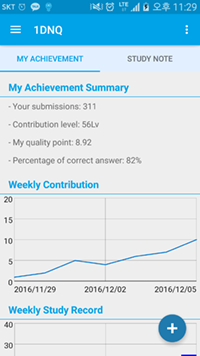
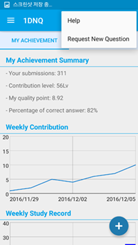
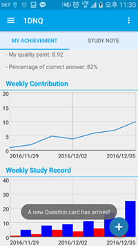
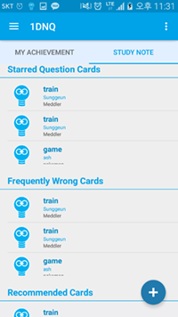
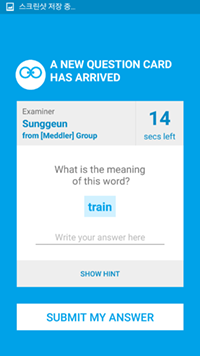
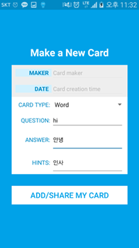
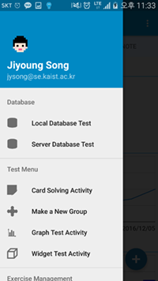
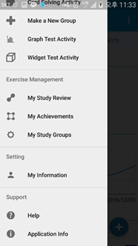
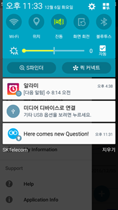

