Low-Fi Prototype
=======================

CS492 Crowdsourcing - Final Project: **Milestone 4** (2016-11-10)

- 20165192 Sunggeun Ahn (topmaze@kaist.ac.kr)
- 20165161 Young-Min Baek (ymbaek@se.kaist.ac.kr)
- 20163703 Sungjae Hong (yain@kaist.ac.kr)

----
		
## A. Problem Identification

### PROBLEM STATEMENT & GOAL

#### What is the problem our team is trying to solve?

- **Global problem**: Unfair and ineffective environment for learning and education
 + specific problem 1. We need to study anytime and anywhere
 + specific problem 2. We need to be motivated to learn
 + specific problem 3. We need newer and more diverse problems
- **High-level goal**: Fair opportunity of effective education using crowdsourcing
　
#### Our solution: Let's think about a study group using smartphones

- **Crowdsourcing platform for study groups**
 + Make & share a new problem as a worker
 + Solve crowds' problems as a learner
 + Evaluate crowds' problems for improvement
 + Manage our own learning history for review


#### Why do we use crowdsourcing for the problem?

- **Crowds** can **effectively stimulate learners** to study in a **person-to-person** way.



----

##B. Tasks

### BRIEF SUMMARY

Name of platform: ***1-Day-N-Questions*** (N can be an arbitrary number)

Our platform utilizes crowdsourcing technique to address issues of the fairness of education. Our main goal is to offer equal opportunity to learners based on crowdsourced knowledge. Our system basically supports learners just like a *study-group system*. More specifically, Every user can be both a requester and a worker, and each user receive help from (or offer help to) other users over our platform. The users can benefit from not only *sharing their customized problems*, but also *managing their own learning history*. Lastly, for the sake of implementation-level simplicity, we only focus on English-related problems, such as English words, phrases, and sentences.

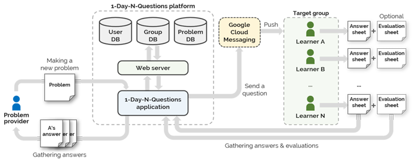


.................................................................................................................................

### TASK 1. Making a New Problem

##### About Task 1:

In order to get answers of a given problem, the first thing we have to do is *to make (or write) a new problem*. For an easy process of problem making, a specific type of question should be defined by our platform and intuitive user interface should also be provided. Our platform mainly supports English-related problems and each problem can be easily customized by a problem provider. Afterwards, the written problem is released to unspecified learners (crowds) through our platform, and those who receive the problem will try to solve it [*Task 2*]. 


##### Requirements:

+ **Requirement 1-A: A system must provide a submission form for a user to fill out or customize**
	+ A submission form contains: (1) A question, (2) following statement/selection, (3) expected answers, (4) tags related to the question, (5) hints, (6) a textbox for extra description/help, (7) a time limit, (8) a submission button, and (9) an initialization button.
	+ Tags can be used as hints of the answer, so inserting tags is not mandatory.
	+ When a question maker submits the written problem, our system must save the data into the database and categorize it.
+ **Requirement 1-B: Each problem (question) has to contain a time limit defined by a question maker**
	+ In order to test whether other users know the answer or not without cheating, the time limit is used. 
	+ A time limit cannot exceed 2 minutes.
+ **Requirement 1-C: A system must check redundancy of written problems and filter out them in real-time**
	+ Our system should analyze the written question and following statement/selection with its expected answers and compare them with the stored data in DB.
	+ If a word is found in DB, but not found in question-maker's word book, the new question is simply stored in his or her word book DB.
	+ If an already existing word is found in question-maker's word book, a popup message box should be shown to the question maker immediately.


.................................................................................................................................

### TASK 2. Solving and Evaluating Problems + Checking My Groups & Study History

##### About Task 2:

In order to solve problems, the system should let the other users receive the problems first. For the ease of use, this process should be automatically done by the system. For example, an alarm system can be one possible approach for this sub-task. After the receive, the system should provide an interface for solve the problems. The interface should be simple and the process must not demand much typing because the system is mobile-based. Lastly, the system should give the users a way to evaluate the given problems. Additionally, a learner need learning record to estimate academic achievements, to schedule study plan, and, to motivate his/her learning. 


##### Requirements:

+ **Requirement 2-A: A system must provide an automatic process for users to receive problems**
	+ An alarm will go to an user if the user receives a problem
	+ For an active user who wants to study more, a system should provides a button in a system to receive a problem
+ **Requirement 2-B: A system must provide a simple interface and process for users to solve problems**
	+ Single problem, without an answer, is shown to an user after receiving it
	+ After pushing the button, the answer will be shown to an user
+ **Requirement 2-C: A system should give the users a way to evaluate the given problems**
	+ Three buttons("Easy" "Normal" "Hard") are given to users to evaluate a problem after a solving process
+ **Requirement 2-D: Record must provide a distinctive dimensions of learning status**
	+ To schedule a learning plan, a user must know strength point and weakness point of own achievement level. Tags, described in the Task 1, can be a distinctive dimensions for achievement level. 
+ **Requirement 2-E: Record must include a improvement history**
	+ Learning history can provide a information about the effort of learning. However if there are no information about the achievement level, a learner shouldn't convince result of learning, therefore, record must include history of improvement to determining current status of learning. 


----

##C. Prototype

### BRIEF SUMMARY

For the success of the platform to solve the problems stated, evaluations to check the effectiveness of the idea and the usability are necessary. However, it would cost too much and be unnecessary to construct full platform for user evaluations in a developing phase, because what we want to be evaluated are only core parts of the platform. Therefore, it would be better to create a prototype for a platform and get evaluated. Fortunately, there are variety of platforms and services which help developers to create their own prototypes, such as proto.io, Marvel, and so on. 

.................................................................................................................................

### PROTOTYPING TOOL

##### Choice of the tool: Marvel

Official Website: [https://www.marvelapp.com](https://www.marvelapp.com)

Four criteria are used to choose the prototyping tool: easeness, fanciness, scalability, and additional features. Marvel provides GUI, which does not need any coding knowledge, for developers who want to create prototypes. Moreover, it provides various fancy designs and enables .psd formats to be used so developers can create fancy prototypes. Marvel also gives PC, iPhone, iPad, and Android frames so developers do not have to worry about what if there is no appropriate frame for the prototype. In addition, the platform enables to import images from dropbox, so efficient development of prototype is possible for the team, as we have done most of works on dropbox.

##### What worked well with Marvel:

As described above, Marvel enables us to provide a prototype in short amount of time with nice visualization. Moreover, it provides smartphone interface so the easeness on the prototype creation improved.

##### What did NOT work well with Marvel:

First, due to its simpleness, the platform does not provide detailed situations, such as typing a text. Moreover, as it is mere a prototype, we cannot provide an algorithm onto a prototype, which helps the platform to provide user-based experience. In addition, Marvel does not provide smartphone-based prototype usage unless spending money. Although using the link we can play the prototype test through the smartphone, this made inconvenience.

.................................................................................................................................

### Design Choices

##### Choice of elements NOT to implement:

+ **NOT to implement 1: Typing texts, Background algorithms, Buzz alarms**
	+ These elements cannot be impelemented through Marvel, thus we do not implement those on the prototype.
+ **NOT to implement 2: Initial sign-up stage to get into cyber study group**
	+ As this is related with background algorithms which can allocate users in study groups of proper level, we decided not to implement this stage.

.................................................................................................................................

### Screenshots of Important Scenes in Prototype

#### Screenshots for Task 1

- Prototype link: [TASK1-PROTOTYPE (https://marvelapp.com/159c7g9)](https://marvelapp.com/159c7g9)
	- Run our 1DNQ app using a floating button
	- Make a new word card (question)
	- Add a new card into individual wordbook, and share it with others
	- Check the message

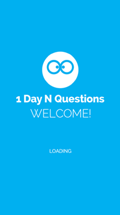
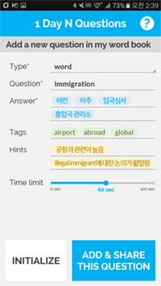
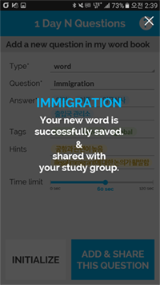


#### Screenshots for Task 2

- Prototype link: [TASK2-PROTOTYPE (https://marvelapp.com/125i8fc)](https://marvelapp.com/125i8fc)
	- Check a push message
	- Solve a given problem (question)
	- Self evaluation of the answer
	- Evaluate the question
	- Check my study groups and study records
	- Review my study
	- Search a new group and join it
	- Check my group list

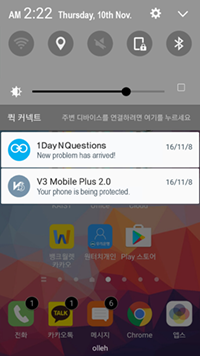
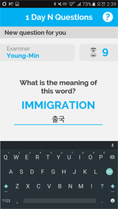
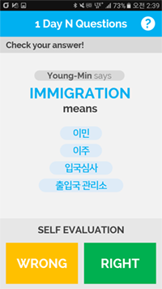
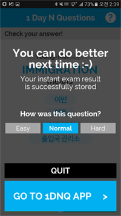
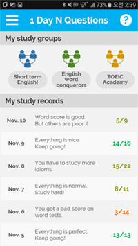
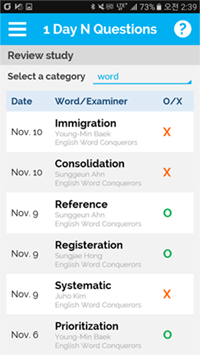
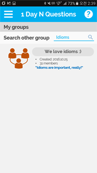
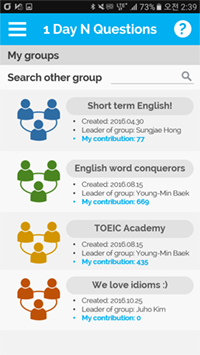


.................................................................................................................................

### Instructions for User Feedback

#### Purpose 
- To find out the usability problems in the prototyped interface of the platform
- To get the insight about some decision factors for the platform, such as how many times push alarms should ring for a day

#### Task 1: Submitting a question (15 min.) 
- Process
	- Provide a reading material for task 1 
	- Let participants to read the reading material 
	- If the participant finds a unknown word, 
	- Find a meaning of the word using a dictionary, then
	- **Write down a word on the blank**
	- **Write down expected answers**
	- Select a tag
	- Set a hint
	- Set a time limit
	- (Optional) Write down extra destriptions
	- Click a submission button

- INSTUCTION (유저스터디용 인스트럭션)
	- Read a given reading material in detail,
		- 주어진 자료를 자세히 읽으면서 
	- If you find an unknown word in the paper, please record a word on the given application.
		- 읽다가 모르는 단어가 있으면 이 어플리케이션에 기록을 해주십시오
	- For this task, you can record a word instantly on the application, or just check-and-skip at time and record all checked words altogether after reading.
		- 단어 기록은 모르는 걸 찾았을 때 바로 기록할 수도 있고, 아니면 체크만 하고 넘어갔다가 한꺼번에 기록해도 됩니다다. 
	- And, you should say all of your 'thinking aloudly' while you do a task.
		- 그리고 테스크를 수행하면서 드는 모든 생각들을 말하면서 수행해 주십시오.

#### Task 2: Solving & evaluating a question
- Two different situations (10 mins each): to monitor difference responses between different level of engagements about study and smartphone. Also, if someone does his/her job, he/she should halt his/her activity and engage to the question (or ingnore an alram and question).        
	- Situation 1: While task 1 
		- Studying an English
	- Situation 2: Watching video on PC
		- Playing without smartphone (low engagement about smartphone and in the rest)

- Process
	- Let participants to do a given activity
	- While doing the activity, the prototype provides an alarm for question irregularly.
	- If participant notices an alarm,
	- Let him/her halts his/her activity,
	- Solve a question
	- Check an answer
	- Save whether the user's answer is right and how was the question
	- (Optional) Check the user's status, including wordlist and current groups where the user is in
	- After solving a question, he/she evaluates a question and turns back to his/her activity.

- INSTUCTION (유저스터디용 인스트럭션)
	- While you do given activity (study, watching video 1, 2)
		- (situation 1) 테스크 1처럼 공부를 하다가
		- (situation 2) pc에서 영상을 보다가
	- If you get an alarm, please halt your activity and check an alarm. Then, you should solve a question.
		- 알람이 오면, 하던 것을 중지하시고 알람을 확인하고 문제를 풀어주십시오
	- After solving the problem, you should evaluate a question you just solved.
		- 문제를 풀고나면 푼 문제에 대해서 평가를 해주시면 됩니다.
	- Also, similar to the previous task, you should say all of your thinking aloudly during a task.
		- 그리고 테스크를 수행하면서 드는 모든 생각들을 말하면서 수행해 주십시오.

#### Questionnaire (for each task or situation)
- How easy to use? (1-5: 1- very negative, 3 - normal , 5 - very positive) 
- How helpful to study? (1-5) 
- How annoying? (1-5)

----

##D. User Feedback

Four users attended for the task. While two people (Sangyoon, Minchul) are not that familar with English, two others (Yeseul and Jungmin) undergraduated from department of English studies or undergraduated from US college. Through the test from diverse samples, the team can get various comments of the platform which can help us to improve the platform.

To summarize, there are number of criticisms on the hint or tag in problem making process. Moreover, mumber of additions on the platform are recommended: the expansion of platform to widget, enabling google search, taking picture for making a question, and so on. Less texts on UI and gamification are also recommended by testers.

###User Feedback Summary###

- Comment 1: *"It would be better to provide google link for the English word, idiom, or phrase to understand more about the words. Through the link, the users can learn more about usage of the term."(Yeseul)*

- Comment 2: *"It would be better for the platform to have a control bar to change number of push alarms the platform receives for each day. If there are too many alarms, they may annoy the users."(Jungmin)
*
- Comment 3: *"It is hard to understand why there is a tag, which describes the characteristics of the term, for the term. Rather then characteristics of the term itself, "different" status, such as whether the term is for TOEIC or TEPS, will be more useful." (Jungmin)
*
- Comment 4: *"If the application can display English words for the study using widget in the android, the usefulness will be improved" (Yeseul)
*
- Comment 5: *"As this seems to be used for English study group, another way of making a question - just taking a picture of the question - can be easier way for the user to make a question" (Jungmin)
	*
- Comment 6: *"I am not sure whether this application will be much better than usual English word list existing in Google Store, or others" (Jungmin)
*
- Comment 7: *"It would be better if the problem provider can mark the hardness and importance of the question" (Sangyoon)*

- Comment 8: *"It would be better if there is reference of the question and gamification" (Sangyoon)*

- Comment 9: *"Tag makes me hesitating because I am not sure what to put" (Minchul)*

- Comment 10: *"If there is brief information of the question on alarm, it may make the platform better" (Sangyoon)*

- Comment 11: *"There are too much texts on UI" (Sangyoon)*

- Comment 12: *"Searching ability is necessary for the platform for wordlists" (Minchul)*

- Comment 13: *"Pushing an alarm is quite annoying" (Minchul)*

- Comment 14: *"Making a question is quite time-consuming" (Jungmin)*


----

