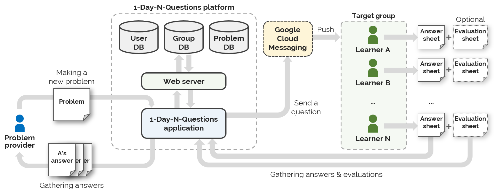
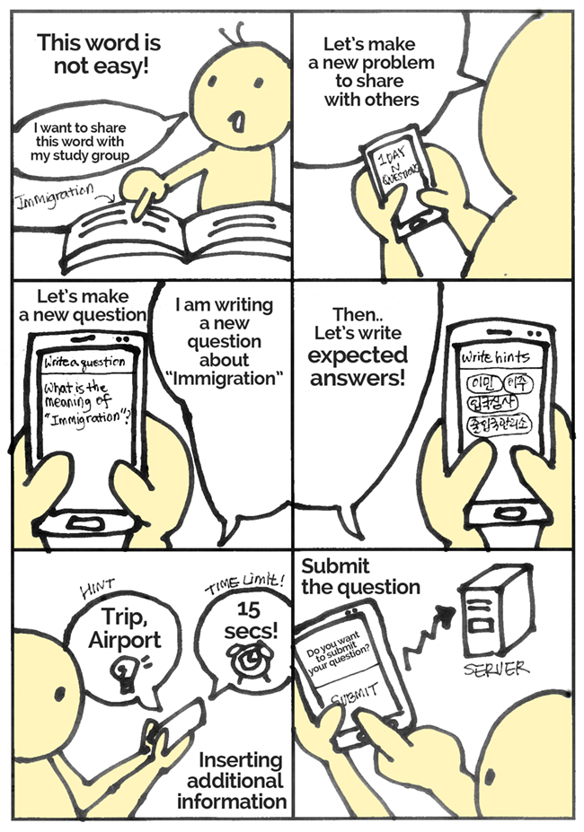
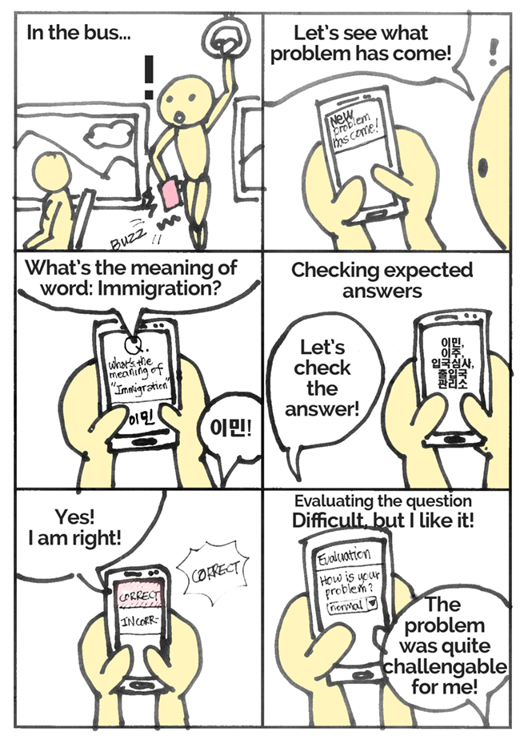
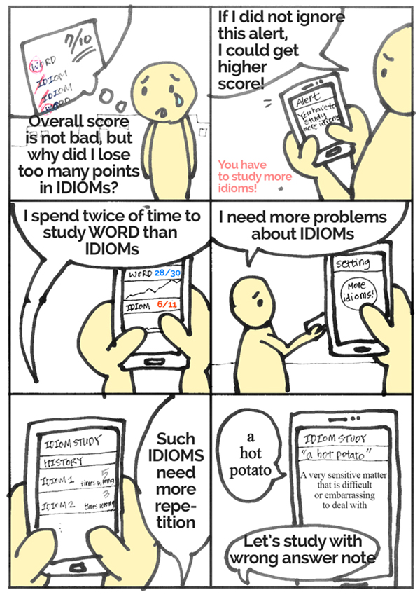

Requirement Elicitation & Story
=======================

CS492 Crowdsourcing - Final Project: **Milestone 2** (2016-10-13)

- 20165192 Sunggeun Ahn (topmaze@kaist.ac.kr)
- 20165161 Young-Min Baek (ymbaek@se.kaist.ac.kr)
- 20163703 Sungjae Hong (yain@kaist.ac.kr)

----

##A. Task Definition

### Introduction

Name of platform: ***1-Day-N-Questions*** (N can be an arbitrary number)

Our platform utilizes crowdsourcing technique to address issues of the fairness of education. Our main goal is to offer equal opportunity to learners based on crowdsourced knowledge. Our system basically supports learners just like a *study-group system*. More specifically, Every user can be both a requester and a worker, and each user receive help from (or offer help to) other users over our platform. The users can benefit from not only *sharing their customized problems*, but also *managing their own learning history*. Lastly, for the sake of implementation-level simplicity, we only focus on English-related problems, such as English words, phrases, and sentences.

.................................................................................................................................

### Task 1. Making a New Problem

##### About Task 1:

In order to get answers of a given problem, the first thing we have to do is *to make (or write) a new problem*. For an easy process of problem making, a specific type of question should be defined by our platform and intuitive user interface should also be provided. Our platform mainly supports English-related problems and each problem can be easily customized by a problem provider. Afterwards, the written problem is released to unspecified learners (crowds) through our platform, and those who receive the problem will try to solve it [*Task 2*]. 

For example, *Young-Min (28, male)*, who is a normal university student, was memorizing English words, and he found a word that he did not know (or a sentence that he could not translate). He wants to memorize the word and share the word with his study group. He opens our 1DNQ application on his smartphone to make a new question. He writes a question "*What is the meaning of this word?*" and writes following statement "*intrinsic*." For the new question, he fill out expected answers of the question, "*고유한*", "*본질적인*", and related tags and hints "*adjective*", "*antonym-extrinsic*." He sets a time limit of '20 secs' and he finally submits the new question to the server. This process makes *Young-Min* a question maker.

##### Requirements:

+ **Requirement 1-A: A system must provide a submission form for a user to fill out or customize**
	+ A submission form contains: (1) A question, (2) following statement/selection, (3) expected answers, (4) tags related to the question, (5) hints, (6) a textbox for extra description/help, (7) a time limit, (8) a submission button, and (9) an initialization button.
	+ Tags can be used as hints of the answer, so inserting tags is not mandatory.
		+ Examples of classes: Noun(+Pronoun), Verb, Adjective, Adverb, etc.
		+ Examples of types: Living things, Nonliving things, Abstract, etc.
		+ Examples of hints: Flower, Korea, etc.
	+ When a question maker submits the written problem, our system must save the data into the database and categorize it.
		+ Using the data of a new question, our system should classify the question automatically. The classified questions will be transferred to proper groups of users.
+ **Requirement 1-B: Each problem (question) has to contain a time limit defined by a question maker**
	+ In order to test whether other users know the answer or not without cheating, the time limit is used. 
		+ For example, *Young-Min (28, male)*, who found a word that he didn't know, is now making a new question about the word. He thought that the meaning of the word can be easily guessed through the form of the word. So, he set the time limit of only '*15secs*' that is allowed time to solve his question.
	+ A time limit cannot exceed 2 minutes.
		+ In order to reduce the complexity of questions, our platform puts a limitation on problem-solving time. Even for a difficult Enlgish sentence, 2 minutes of time is enough to judge whether a user knows the answer or not.
+ **Requirement 1-C: A system must check redundancy of written problems and filter out them in real-time**
	+ Our system should analyze the written question and following statement/selection with its expected answers and compare them with the stored data in DB.
		+ If there are many redundant questions in DB, 
	+ If a word is found in DB, but not found in question-maker's word book, the new question is simply stored in his or her word book DB.
	+ If an already existing word is found in question-maker's word book, a popup message box should be shown to the question maker immediately.
		+ Message: "The word that you just wrote was already in your word book. Do you want to update your word book?"  
		+ Response: [Update the existing data], [Cancel]

.................................................................................................................................

### Task 2. Solving and Evaluating Problems

##### About Task 2:

In order to solve problems, the system should let the other users receive the problems first. For the ease of use, this process should be automatically done by the system. For example, an alarm system can be one possible approach for this sub-task. After the receive, the system should provide an interface for solve the problems. The interface should be simple and the process must not demand much typing because the system is mobile-based. Lastly, the system should give the users a way to evaluate the given problems.

For example, *Sungjae (25, Male)*, who is an university student, is on the train and finding anything to play. Then, his smartphone buzzes, noticing there is a problem sent from a platform. He finds pop-up button on his smartphone screen and click it. The application shows a problem on the screen: *What is the meaning of word? 'intrinsic'* and before time runs out, Sungjae remembers that intrinsic means "*고유한*" and clicks check button to confirm the answer. After the click, the answers, "*고유한*" and "*본질적인*" are displayed on the screen and Sungjae finds that he is right. After then, he clicks the "Right" button among three buttons - "*Right*", "*Wrong*", and "*I Don't Know*" - and also evaluate sthe level of difficulty of the problem, by clicking "Normal" button among three buttons for difficulty of the problem: "*Easy*", "*Normal*", and "*Hard*". This process enables Sungjae to receive, solve and evaluate a problem.

##### Requirements:

+ **Requirement 2-A: A system must provide an automatic process for users to receive problems**
	+ An alarm will go to an user if the user receives a problem
		+ Number of alarms(problems) an user receives can be controlled by itself
		+ Pushing a popped box on a mobile device screen lets an user to start a system and see a received problem
	+ For an active user who wants to study more, a system should provides a button in a system to receive a problem
+ **Requirement 2-B: A system must provide a simple interface and process for users to solve problems**
	+ Single problem, without an answer, is shown to an user after receiving it
		+ A button to check the answer is provided for further process
		+ Time until pushing the button is recorded to collect time to solve a problem
			+ The record will be used to evaluate the user and the grouping of users to aggreate them with similar English skill level
		+ If time set by a problem maker is over, the answer will be automatically checked
	+ After pushing the button, the answer will be shown to an user
		+ Three buttons ("Right" "Wrong" "I Don't Know") are provided to evaluate an user itself
			+ If an user comes to this step after the timeout, "I Don't Know" button will be automatically pushed
		+ Similarly, whether an user is right or wrong, or doesn't know the answer will be recorded
			+ The record will be used to evaluate the user and the grouping of users to aggreate them with similar English skill level
+ **Requirement 2-C: A system should give the users a way to evaluate the given problems**
	+ Three buttons("Easy" "Normal" "Hard") are given to users to evaluate a problem after a solving process
		+ The evaluation will be collected by a system to evaluate a problem and to evaluate an user who solves a problem
			+ This will be used to evaluate the user and the grouping of users to aggreate them with similar English skill level
			+ If the problem is evaluated as easy one, the problem will be not included in the problem database of the user
			+ This feedback on the problem also can be sent to the problem maker to provide a better problem

.................................................................................................................................

### Task 3. Checking User's Own Record for Learning Improvement

##### About Task 3:

A learner need learning record to estimate academic achievements, to schedule study plan, and, to motivate his/her learning. For example, Mr. kim, who is a 18 years old high school student. He take a english quiz in last week and get a result in this day. His score is fine, but he take off points at questions about adjective. He is disappointed with the results, because he got a perfect score at questions about adjective in the previous quiz. So he want to know his achievement level for preparing each upcoming quizs or exams.    

##### Requirements:

+ **Requirement 3-A: Record must include a improvement history**
	+ Learning history can provide a information about the effort of learning. However if there are no information about the achievement level, a learner shouldn't convince result of learning, therefore, record must include history of improvement to determining current status of learning. 
		+ Learning history should be make easy to interpret: visualization
		+ Learning history should be make easy to access: shown at main page, floating button, etc
		+ Learning history should be show recent achievement level: result of recent "some duration"
+ **Requirement 3-B: Record must provide a distinctive dimensions of learning status**
	+ To schedule a learning plan, a user must know strength point and weakness point of own achievement level. Tags, described in the Task 1, can be a distinctive dimensions for achievement level. 
		+ Dimensions should reflect context of learning: if a user learning for traveling, dimensions may distinguished by traveling context
		+ A number of dimensions should be suitable to use: if there are too much dimensions, users hard to interpret a record. In otherwords, if there are too less dimensions, dimensions may be useless.
+ **Requirement 3-C: A system must provide a alert for unbalance learning**
	+ Learners sometimes only study about the interesting or about the weakpoint. System can monitor those behavior from learning history. Therefore, system must provide a alert to induce balanced learning. 
		+ Alert should be strongly noticeable. 
		+ Alert should be reflect a slope of improvement history: improvement is not necessarily proportional to learning time
		
----

##B. Sketches

If the images are not displayed, please check the images in the browser.

+ Task 1: images/01-small.jpg
+ Task 2: images/02-small.jpg
+ Task 3: images/03-small.jpg

### Task 1. Making a New Problem

### Task 2. Solving and Evaluating Problems

### Task 3. Checking User's Own Record for Learning Improvement

----

##C. Video

Video is uploaded on Youtube ([https://www.youtube.com/watch?v=1-lxBcrYE8w](https://www.youtube.com/watch?v=1-lxBcrYE8w))

----