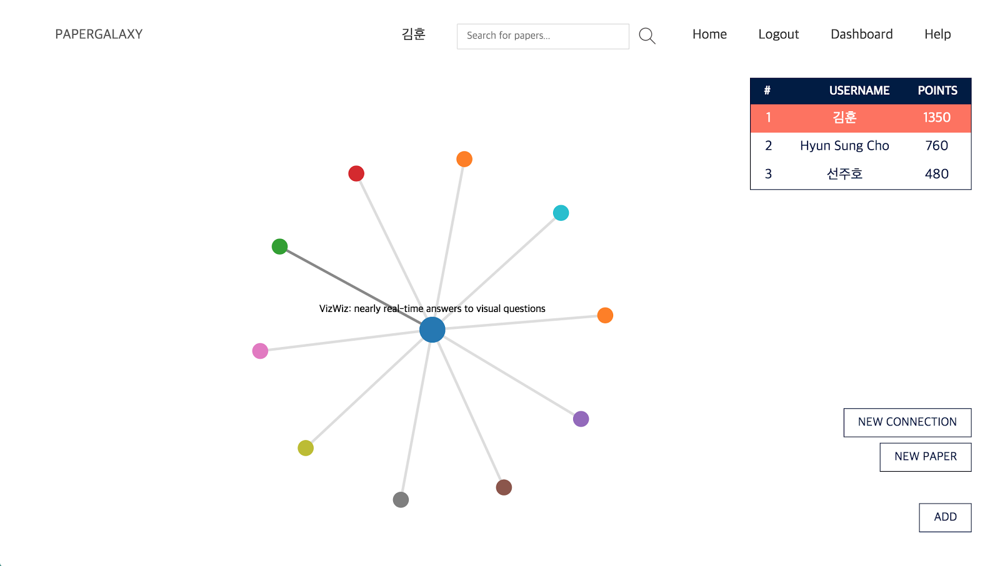
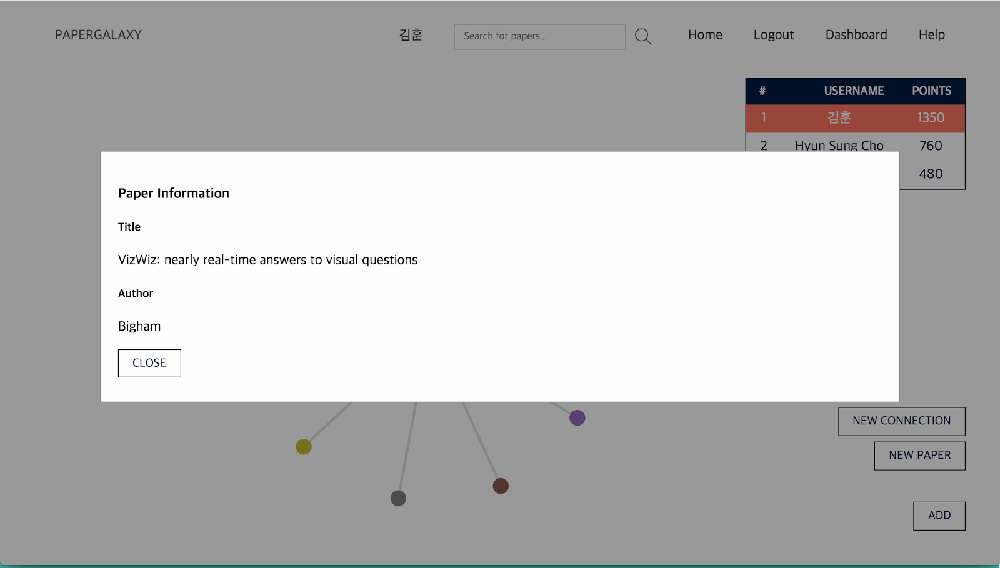
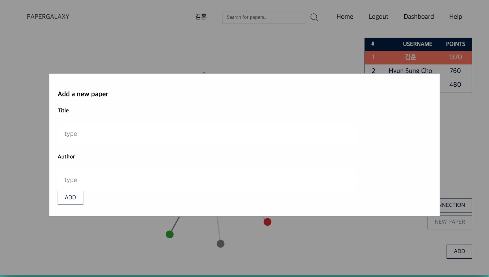
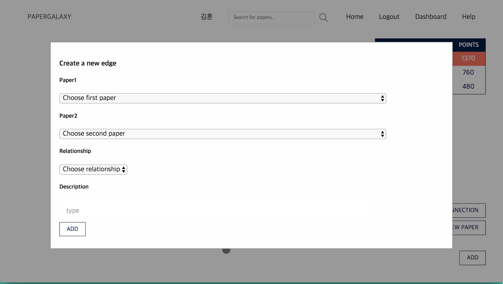

##[PAPERGALAXY](http://juhojuho.com/papergalaxy)
###What is PaperGalaxy?
Understanding how each research paper is connected to each other is very important for researchers and students for them guide themselves in the wide world of science . PAPERGALAXY aims to create a semantic network of academic papers that represents how papers are related to one another.

###What do users do with PAPERGALAXY?
1. Users can be guided in his/her paper finding process  through PAPERGALAXY.
2. Crowds voluntarily connect papers.
3. Authors add their paper on the platform and make connections to other papers.
                                
###Who is behind PaperGalaxy?
We are researchers at the Korea Advanced Institute of Science and Technology (KAIST). Hyunsung Cho, Juho Sun and Hoon Kim founded PaperGalaxy.
                                
###How is PaperGalaxy different from Semantic Scholar or other paper search solutions?
Unlike other solutions, PAPERGALAXY uses crowdsourcing to find connections between paper, in which every connection between researches is created by the crowd.
                                
###How do participants hear about PaperGalaxy?
PaperGalaxy leverages the fact that participants recruit each other. People spread the word via social networks, blogs, or newspaper sites. 
                                                          
###What makes PaperGalaxy fun and useful?
1. One can Contribute to academia.
2. Scholars can advertise their work.
3. Other users can recognize your work.

###Where can I sign up?
You can participate in any PaperGalaxy work without signing up.
If you would like other people to recognize your work on PaperGalaxy,
please sign up using Sign Up tap on the navigation bar.

###Can I get the source code to your experiments?
We will gladly share the source code.
Source Code is located at [github](https://github.com/choch-o/PaperGalaxy).
Please send us an email to gnsrla12@kaist.ac.kr, 
to inquire about the experiment that you are interested in.

###How are PaperGalaxy experiments implemented?
We mostly use Javascript, D3 and Firebase to implement Paper Galaxy.

###Representative screenshots
- Main page 
- Search results page 
- Showing the relationship between two papers 
- Showing information of certain paper 
- Adding new academic paper into database
- adding connection between two papers 

