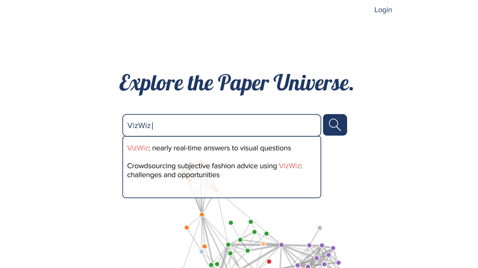
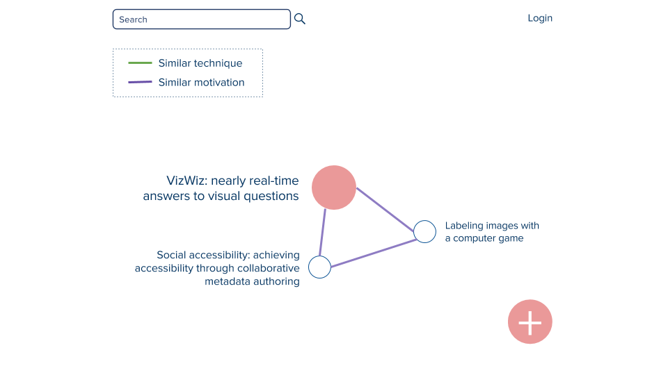
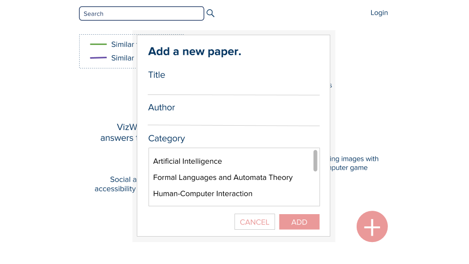
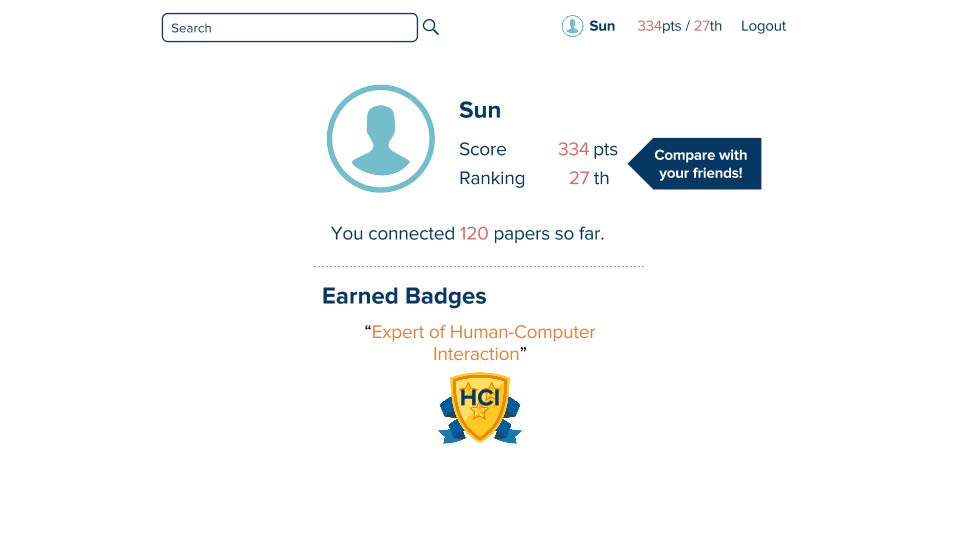
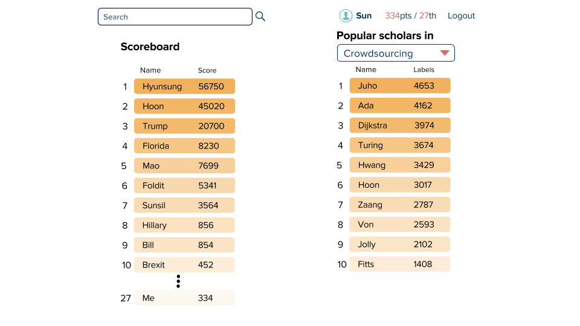

## Milestone 4 Report
###Team KimChoSun
#### Problem Statement
Our system aims to create a semantic network of academic papers that represents how papers are related to one another with data provided by academic paper readers themselves. 
	
#### Tasks
Users want a platform that can guide his/her through his/her paper finding process.
Crowds voluntarily connect papers.
Authors add their paper on the platform making connections to other papers.

#### Prototyping tool
We used Invision because one of our teammate had some experience with the tool. Its simple UI made it easy to get used to the tool at first. However, it does not provide features for drawing a new item on the prototype or editing a item. We had to create our image file in other programs, export them, and upload them on Invision to add to the prototype. Editing had to go through the same step as well.
It provides only ‘Click’ and ‘Hover’ actions and not typing, dragging, or others.

#### Design choices
- We did not implement the Sign up page because we thought this is not our system’s main feature, while it is very burdensome to create it with Invision.
- We have upvote and downvote features for our labels on edges but implemented only one upvote case because implementing all of them meant hundreds of more, manually generated images.
- The graph in the main page was replaced with a static image because it was hard to make graphics of interactive graph map.
- Scores in dashboards are fake data. No one has used our platforms, so there is no choice but to make data by ourselves.
- Only limited number of papers and edges are clickable and shows information. We thought it is enough to enlighten users.
- Writing a word in search box is not allowed. Invision doesn’t support texting feature.
- There is only one badge. We thought the number of badges isn’t important for rapid prototyping.
- There are only three relation categories. We haven’t discussed how many relation categories we will provide for users. These will be decided when we actually implement the platform.
- There is no such user called ‘Sun’. We made him to show how profile page and dashboards are organized.

####Representative screenshots

**Main Page**

**Search results page**

**Adding new academic paper into database**

**Showing the relationship between two papers**

**Profile**

**Scoreboard**

#### Instructions 
[Link](https://invis.io/HP9A3927Z)

*Following instructions exclude duplicate actions, such as functions of buttons in the header.*

**In the Main Page**

1. Click on ‘Login’ -> Login Page
2. Click on ‘Search Button’ without anything in the search box -> No Results Page
3. Click on ‘Search Box’ and then ‘Search Button’ -> Search Result Page

**In the No Results Page**

1. Click on ‘ADD NEW PAPER’ -> Add a New Paper Page 1

**In the Add a New Paper Page 1**

1. Click on ‘CANCEL’ -> back to the previous page
2. Click on ‘ADD’ -> Search Result Page

**In the Search Result Page**

1. Click on ‘+’ button -> shows click on ‘NEW PAPER’ button and ‘NEW CONNECTION’ button
2. Click on ‘NEW PAPER’ -> Add a New Paper Page 2
3. Click on ‘NEW CONNECTION’ -> Add a New Connection Page
4. Click on the central node in pink -> Paper Information Page
5. Click on the green edge (not present at first, appears when new paper is added) -> Edge Information Page

**In the Add a New Paper Page 2**

1. Click on ‘ADD’ -> Search Result Page with one more node added (only once)
2. Click on ‘CANCEL’ -> Back to the previous page

**In the Add a New Connection Page**

1. Click on ‘ADD’ -> Search Result Page with the green edge added (only once)
2. Click on ‘CANCEL’ -> Back to the previous page

**In the Login Page**

1. Click on ‘LOGIN’ -> Profile Page

**In the Profile Page**

1. Click on ‘Logout’ -> Main Page
2. Click on ‘Compare with your friends!’ -> Leaderboard Page
3. Click on points stat in the header -> Leaderboard Page
4. Click on profile picture and name in the header -> Profile Page

**In the Leaderboard Page**

1. Click on the ‘Select Category Box’ -> opens the category list of fields in computer science
	
#### User feedback
- I’m lost in the middle of the platform. I want a navigation bar to find out which page I’m currently in.
- I don’t like to scroll on the main page. I hope all the contents are visible at once on the screen.
- The data visualization part is not scalable. If the number of connections increases, undirected graph will get messier.
- I’m not sure how the scores are given. We need more specific instructions that explains how and when I get the point.
- You need more strong argument to support the idea that making more connections on the system gives benefits to the authors, and thereby motivation for them to work.
- Instead of showing just connections among papers, having a paper preview/reading platform alongside will make the system more natural in user involvement so that users can make connections while reading a paper.
- The system assumes that the users are fully aware of academic papers they have read so far.
- Differentiating stronger/weaker relationships between papers will be more effective. Add color transparency or distance between two nodes (length of edge) as a display method of relationship strength.
- In the Main Page, it would be better if clicking on the auto-completed/suggested title in the search box leads directly to the Search Result Page.
- I have no idea what is the meaning of the graphs in the main page. It needs some indicators to explain about it.
- Even though there is ranking system to encourage workers, I think motivation is weak. It should have more powerful motivation.
